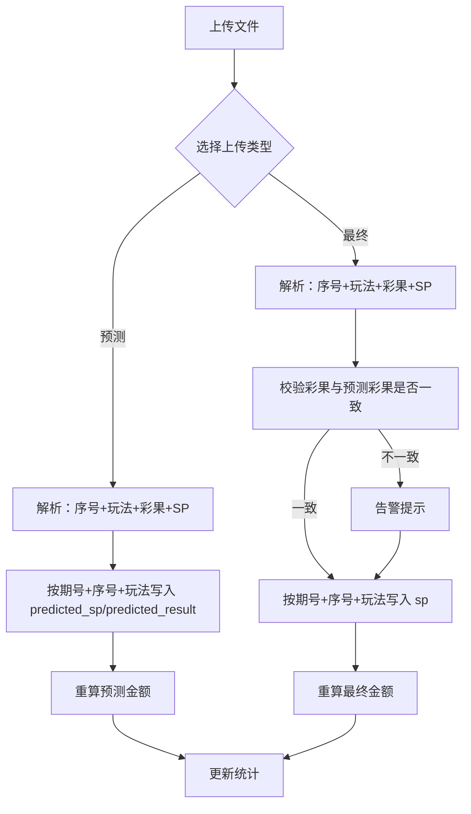

# 中签管理预测功能需求文档

## 一、需求概述

在现有的中签管理上传结果流程中，新增"上传预测结果文件"功能，支持同一中奖数据同时存储预测奖金和最终奖金，用于对比分析。预测与最终数据的唯一差异是 SP 值不同。

---

## 二、数据库变更

| 字段名 | 类型 | 说明 |
|--------|------|------|
| `predicted_sp` | DECIMAL | 预测SP值 |
| `predicted_result` | VARCHAR | 预测彩果 |

> **注意**：现有 `sp` 字段语义不变，继续作为**最终SP**使用。

---

## 三、上传逻辑

### 3.1 上传入口
- 在"中签管理"的上传结果处，增加**上传类型选择**：预测 / 最终

### 3.2 文件格式
- 预测txt与最终txt**格式完全相同**，仅SP值不同

### 3.3 匹配键
- **期号 + 序号 + 玩法代码**（SPF/CBF/JQS/BQC/SXP/SF）
- 彩果不作为主匹配键，仅做一致性校验

### 3.4 写入规则

| 上传类型 | 写入字段 |
|----------|----------|
| 预测 | `predicted_sp` + `predicted_result` |
| 最终 | `sp`（最终值） |

### 3.5 安全机制
- **互不覆盖**：预测和最终走独立字段，按上传类型分流，不会串写
- **整期替换**：同一期同类型上传时，先清空该期该类型数据，再写入新文件
- **一致性校验**：最终文件的彩果与预测彩果不一致时，**告警提示但不拒绝上传**

---

## 四、计算逻辑

### 4.1 金额计算规则

| 场景 | 计算方式 |
|------|----------|
| 最终金额 | 按 `sp`（最终SP）计算 |
| 预测金额 | 按 `predicted_sp` 计算，**同样走计税规则**（超1万扣税） |

### 4.2 涨跌幅计算

```
涨跌幅 = (最终税后金额 - 预测税后金额) / 预测税后金额 × 100%
```

| 情况 | 显示 | 颜色 |
|------|------|------|
| 最终 > 预测 | +xx.xx% | 🔴 红色 |
| 最终 < 预测 | -xx.xx% | 🟢 绿色 |
| 相等 | 0.00% | 默认/灰色 |
| 预测金额为0 | -- | 默认颜色 |

### 4.3 数据完整性处理

| 条件 | 处理方式 |
|------|----------|
| 某场次有预测SP但无彩果 | 记录为"预测未完成"状态 |
| 任意场次缺预测结果 | 不计算预测金额，显示"预测中（数据未完整）" |
| 后续补齐数据 | 自动重算预测金额和预测总额 |

---

## 五、客户端展示

| 条件 | 展示内容 |
|------|----------|
| 有最终SP | 只显示**最终金额** |
| 无最终SP，有预测SP | 显示**预测金额**，标记"预测（非最终结果）"，提示"预测奖金不为最终结果" |
| 预测数据不完整 | 显示"预测中（数据未完整）" |

---

## 六、管理端展示

### 6.1 中签记录管理

**显示字段**：
- 预测金额（税后）
- 最终金额（税后）
- 涨跌幅

**不显示**：差额、预测SP、最终SP

### 6.2 结果计算状态

点击该期"查看"按钮后，在详情中显示：
- 预测SP
- 最终SP

---

## 七、统计逻辑

| 统计项 | 计算方式 |
|--------|----------|
| 预测金额总数 | 基于 `predicted_sp` 计算所有预测金额总和 |
| 当前展示总金额 | 优先显示最终金额总和；无最终金额时显示预测金额总和 |

---

## 八、流程图



---

## 九、核心业务规则总结

| 规则编号 | 规则描述 |
|----------|----------|
| R1 | 预测和最终走独立字段，互不覆盖 |
| R2 | 匹配键固定为：期号 + 序号 + 玩法代码 |
| R3 | 彩果不作为匹配键，仅做一致性校验 |
| R4 | 预测金额和最终金额都必须走统一计税规则 |
| R5 | 涨跌幅以预测金额为基准计算 |
| R6 | 预测金额为0时，涨跌幅显示"--" |
| R7 | 客户端优先展示最终金额，无最终时显示预测金额 |
| R8 | 管理端同时展示预测金额和最终金额，并显示涨跌幅 |